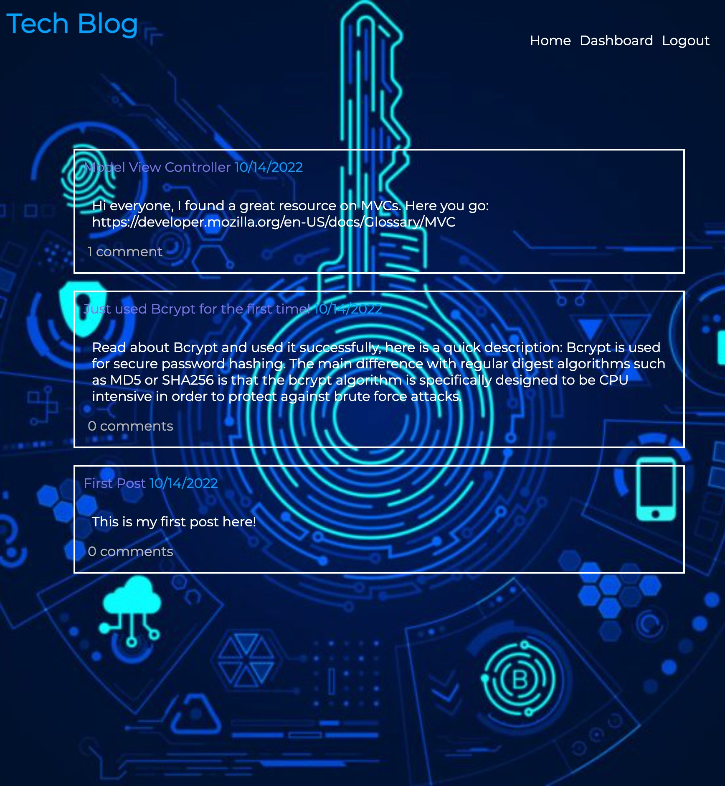
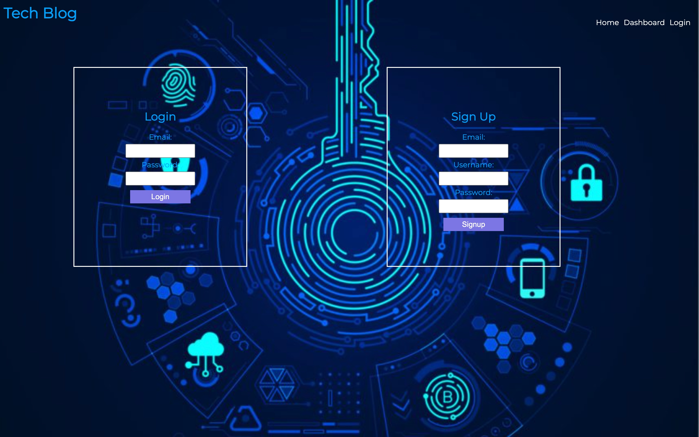
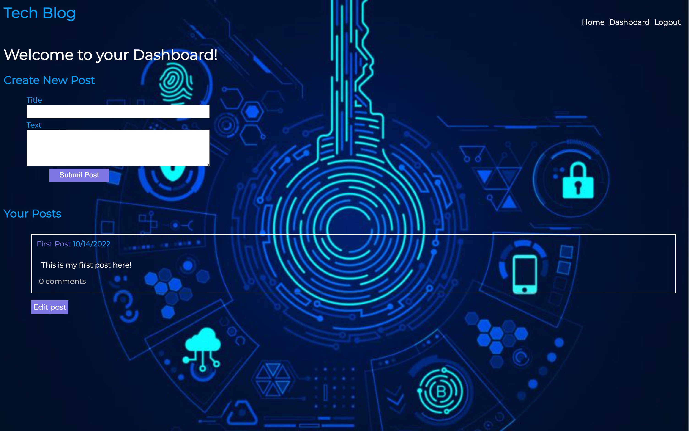

# Model-View-Controller (MVC): Tech Blog

## Description

This application is a CMS-style blog site similar to a Wordpress site, where developers can publish their blog posts and comment on other developers’ posts as well. This app follows the MVC paradigm in its architectural structure, using Handlebars.js as the templating language, Sequelize as the ORM, and the express-session npm package for authentication.

## User Story

```md
AS A developer who writes about tech
I WANT a CMS-style blog site
SO THAT I can publish articles, blog posts, and my thoughts and opinions
```

## Mock-Up

The following animation demonstrates the application functionality:






## Delopyed link
https://mvc-tech-blog-th.herokuapp.com/


## Github link
https://github.com/thaling11/MVC-tech-blog